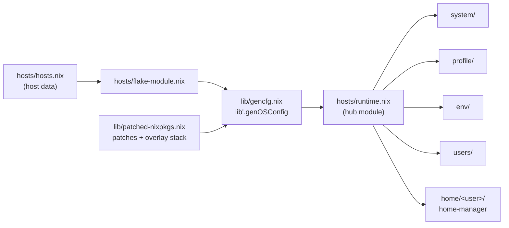

# Repository Guidelines

## Project Overview

Personal NixOS configuration flake ("My NixOS configuration"): x86_64 machines (`ccic-desktop` Intel+NVIDIA, `ccic-laptop` AMD+AMDGPU), two VM test hosts (`vbox-test`, `vmware-test`), and a Plasma 6 installer LiveCD. Built with **flake-parts**; NixOS + home-manager (as a NixOS module) evaluated against a **locally patched nixpkgs**. Core idea: hosts are pure data, behavior is option-driven (`lib.mkIf` gates), and nixpkgs PR backports are managed as patch files.

## Architecture & Data Flow

Two module layers:

1. **flake-parts modules** (repo plumbing) — imported explicitly from `flake.nix` (`lib/`, `modules/`, `pkgs/`, `hosts/flake-module.nix`, `treefmt.nix`, `livecd.nix`, `nixpkgs.nix`, `github-actions.nix`). They define `lib'` helpers, per-system tooling, and flake outputs.
2. **NixOS modules** (system config) — the `system/`, `profile/`, `env/`, `users/` trees, aggregated by `hosts/runtime.nix`, instantiated per host by `lib/gencfg.nix` against patched nixpkgs.



Key wiring facts:

- `hosts/hosts.nix` is the only host declaration (data): entries composed from `desktop-template`/`thin-template` via `lib.recursiveUpdate`. `hosts/<name>/default.nix` is a 6-line shim importing `hosts/templates/{desktop,vm-guest}.nix` + `hardware-configuration.nix`.
- Activation gates: `runtime.profile` (`desktop`|`minimal`|`vm-test`), `runtime.features` (free strings), `runtime.users`. Everything is imported unconditionally and gated with `lib.mkIf` / `builtins.elem` — there are no per-host module lists.
- `hostCfg.*` facts (cpu/gpu/locale/vm, declared in `hosts/modules/*.nix`) feed both NixOS modules and the pkgs builder (`cudaSupport`/`rocmSupport` in `lib/patched-nixpkgs.nix`).
- **Two package sets**: flake-parts `pkgs` (tooling only, `nixpkgs.nix`, NUR+nix-packages overlays) vs per-host `hostPkgs` (patched nixpkgs + multiverse/NUR/nix-packages/nix-gaming/llm-agents/gaze/… overlays). A package available in `nix develop` may not exist on hosts and vice versa.
- `specialArgs`/`extraSpecialArgs` parity: NixOS and home-manager both get `{ self, inputs, inputs', nixConfig, host }` (`lib/gencfg.nix`, `hosts/runtime.nix`).
- `livecd.nix` bypasses the entire host pipeline (plain `nixpkgs.lib.nixosSystem`, unpatched nixpkgs).

## Key Directories

| Path       | Purpose                                                                                                                                                                                     |
| ---------- | ------------------------------------------------------------------------------------------------------------------------------------------------------------------------------------------- |
| `hosts/`   | Host data (`hosts.nix`), hub module (`runtime.nix`), fact modules (`modules/`), templates, per-host hardware. `hosts/README.md` (Chinese) is the authoritative `hosts.nix` field reference. |
| `system/`  | Base OS layer: kernel (`linuxPackages_latest`), sysctl, sudo-rs, nix-ld, etc.; `common/` + per-arch `x86_64-linux/`.                                                                        |
| `profile/` | Role profiles (`common/`, `desktop/`, `minimal/`, `vm-test/`), gated on `runtime.profile`.                                                                                                  |
| `env/`     | Feature packs — **NixOS modules, not dev shells** — each gated on its `runtime.features` string (e.g. `env/gaming/`).                                                                       |
| `users/`   | Accounts; `users/template/wheel.nix` is a factory function `pkgs: username: …`, not a module.                                                                                               |
| `home/`    | home-manager trees: `home/common` (sharedModules) + `home/<username>/` per user; topic dirs aggregate via `default.nix`.                                                                    |
| `lib/`     | flake-parts helpers exported under the `lib'` option namespace: `gencfg.nix`, `patched-nixpkgs.nix`, `nixpkgs-pr.nix`, `lib.nix`.                                                           |
| `modules/` | Flake-level knobs (`patchedNixpkgs.pins`, …) + exported `nixosModules.nixos-tweaks`.                                                                                                        |
| `pkgs/`    | Custom packages → `overlays.default`; `legacyPackages.<system>.top-levels` builds host closures.                                                                                            |
| `patches/` | nixpkgs patches: `hiprio/` (hand-pinned, applied first via `mkBefore`) + `nixpkgs-pr/` (downloaded PR patches).                                                                             |
| `scripts/` | `nixpkgs-prs.sh` — nixpkgs PR patch manager (wrapped as `nix run .#nixpkgs-prs`).                                                                                                           |

## Development Commands

```bash
nix develop            # dev shell: just, nixd, just-lsp
just fmt               # = nix fmt .  (treefmt: nixfmt-rs → deadnix → nixf-diagnose, prettier, shfmt, shellcheck, actionlint)
just fup               # nix flake update --commit-lock-file
just pr <args>         # nixpkgs PR patch manager: show | update | add | remove | prune

# CI-equivalent verification (this is what .github/workflows runs):
nix eval --show-trace '.#githubActions.eval.checks.x86_64-linux."<host>"'    # host: ccic-desktop|ccic-laptop|vbox-test|vmware-test|livecd
nix build -L '.#githubActions.build.checks.x86_64-linux."<name>"'            # treefmt, kernel, virtualbox, wine-tkg-full, …
nix build --no-link .#patchedNixpkgs    # verify patches/ still apply
nix build .#top-levels.<host>           # full system closure (all: .#top-levels)
nix build -L .#nixosConfigurations.livecd.config.system.build.isoImage
```

## Code Conventions & Common Patterns

- **`flake-module.nix` per directory**: each subsystem exports one aggregator; root `flake.nix` imports them explicitly (no auto-discovery). Non-`flake-module.nix` files are plain helpers, not modules.
- **`lib'` option namespace**: helpers are published as `options.lib'.<name> = lib.mkOption { default = <fn>; }`, not `self.lib`.
- **Hosts as data**: add a host = entry in `hosts/hosts.nix` (template + `lib.recursiveUpdate`) + `hosts/<name>/` shim with `hardware-configuration.nix`. Never encode host behavior in module lists.
- **Import-everything, gate-with-mkIf**: `lib.mkIf (config.runtime.profile == "desktop")`, `lib.mkIf (builtins.elem "gaming" config.runtime.features)`.
- **Fact-option pattern** (`hosts/modules/{cpu,gpu,vm,locale}.nix`): attrset of config fragments → auto `mkEnableOption`s → `mkMerge`/`mkIf` selection. Adding a variant = one attrset entry.
- **Feature strings are an untyped contract** with `env/` gate literals — they must match exactly (`"virtManager"` ≠ `virt-manager`). `"browsers"` lives in `env/modules/browsers.nix`, pulled in via `env/plasma/`; `"plasma"` does not imply it.
- **home-manager**: `home/<user>/default.nix` is the per-user entry selected by `runtime.users` (`hosts/runtime.nix`); new user ⇒ matching `home/<user>/` dir. Host-conditional home tweaks key on `osConfig.networking.hostName`.
- **nixpkgs patch workflow**: never edit nixpkgs by hand — `just pr add <n>` records the PR in `nixpkgs-prs.json` and downloads the patch; patches flow into `lib/patched-nixpkgs.nix` (patched source used for both module eval and `pkgs`).
- **`nixConfig` is single-source**: the flake's `nixConfig` (substituters, keys) is re-applied to `nix.settings` in `profile/common/nix.nix`.
- Format before finishing: nixfmt-rs (RFC style), deadnix (no dead bindings), nixf-diagnose run via `just fmt`; Zed formats on save through `nix fmt -- --stdin`.

## Important Files

| File                                         | Role                                                                                                      |
| -------------------------------------------- | --------------------------------------------------------------------------------------------------------- |
| `flake.nix`                                  | Inputs, `mkFlake` import list, `nixConfig` substituters.                                                  |
| `hosts/hosts.nix`                            | All host data (the file to touch for host changes).                                                       |
| `hosts/runtime.nix`                          | Hub NixOS module: `options.runtime.*`, imports `system/`+`profile/`+`env/`+`users/`, home-manager wiring. |
| `lib/gencfg.nix`                             | `lib'.genOSConfig` — builds `nixosConfigurations` via patched nixpkgs' own `eval-config.nix`.             |
| `lib/patched-nixpkgs.nix`                    | Patch set (`hiprio` → `nixpkgs-pr`) + overlay stack + `hostPkgs`.                                         |
| `nixpkgs-prs.json`, `scripts/nixpkgs-prs.sh` | nixpkgs PR patch manifest and manager.                                                                    |
| `github-actions.nix`                         | CI matrices (eval + curated builds via `lib'.findPkgs`) consumed by `.github/workflows/`.                 |
| `treefmt.nix`                                | Formatter/linter set (also the only flake `check`).                                                       |
| `livecd.nix`                                 | Standalone LiveCD config (outside the host pipeline).                                                     |
| `default.nix`, `shell.nix`                   | flake-compat shims for non-flake `nix-build`/`nix-shell`.                                                 |

## Runtime/Tooling Preferences

- **Nix + flakes + nix-command** required (`nixConfig` enables them, `trusted-users = ["@wheel"]`); many cachix substituters are declared — builds depend on them.
- **VCS: colocated jujutsu + git** (`.jj/` + `.git/`). Mutate with `jj` (`--no-pager`, always `-m`, never interactive forms); git is the canonical remote/PR/CI interface; never touch the git index. Push via bookmarks, never to the default branch.
- Editor: Zed (`.zed/settings.json`) — format on save via `nix fmt`; nixd LSP option trees bound to `nixosConfigurations.ccic-desktop` and flake-parts `debug`/`currentSystem`.
- direnv: `.envrc` = `use flake`; `.gitignore` covers `.direnv`, `result*`.
- `scripts/nixpkgs-prs.sh` needs `curl`, `jq`, `moreutils` when run directly (use `nix run .#nixpkgs-prs` instead). CI auth: `$GITHUB_TOKEN` → `gh auth token` → anonymous.
- CI schedules use Asia/Shanghai.

## Testing & QA

No test framework and no NixOS VM tests — QA is CI matrices + formatting + patch gates:

1. **Format/lint**: `just fmt` (the `treefmt` check is built inside the Build Packages CI matrix; formatting failures fail "All Builds").
2. **Eval affected hosts** exactly as CI: `nix eval --show-trace '.#githubActions.eval.checks.x86_64-linux."<host>"'`. Shared-module changes (`hosts/runtime.nix`, `profile/`, `system/`, `env/`, `users/`, `home/`) affect all five hosts — eval all.
3. **Patch changes** (`patches/`, `nixpkgs-prs.json`): `nix build --no-link .#patchedNixpkgs`.
4. **Curated packages**: build via `.#githubActions.build.checks.…`; `lib'.findPkgs` _asserts_ the names exist in evaluated host configs — renaming/removing one breaks matrix eval.
5. Optional full closure: `nix build .#top-levels.<host>`.

Do **not** rely on `nix flake check` — nothing in the repo or CI runs it.

CI (`.github/workflows/`): `eval.yml` + `build-packages.yml` on push/PR to main (gates "All Eval" / "All Builds"; Mergify auto-merges `dependencies`-labeled PRs when both pass); `build-livecd.yml` daily cron; `update-flake-lock.yml` and `nixpkgs-prs.yml` manual. `vbox-test`/`vmware-test` are manual VirtualBox/VMware testbeds, eval'd/built in CI like real hosts.

Known oddities: `lib/apply-patches-cow.nix` is dead code (superseded by the inline `applyPatches` override in `lib/patched-nixpkgs.nix`); the top-level `profile` attr in `hosts/hosts.nix` is vestigial (use `runtime.profile`); arch dispatch is x86_64-only; `system.stateVersion = lib.trivial.release` tracks nixpkgs; `env/howdy/` and `pkgs/wechat/` are empty placeholders.
